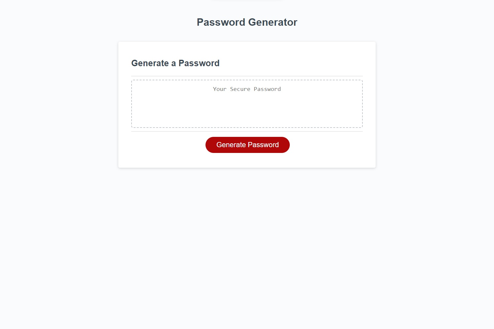

# Secure Password Generator

## Description

This project was created to provide users with an intuitive and and simple way to generate a secure password. Users are given the flexibility of what types of characers to include in and the total length of their generated password. This password generator is intended for general use and may not be able to generate a password suitable for all services.

## Usage

This project is live and can be accessed at the following link: https://honeybuzz94.github.io/secure-password-generator/

Anyone is welcome to use or duplicate this project as they would like. Any passwords generated using this project belong to the user who generated them.

## Credits

Collaborators:

* Valarie Grow

The following resources were used to assist with the development of this project:

* [w3schools](https://www.w3schools.com)

---